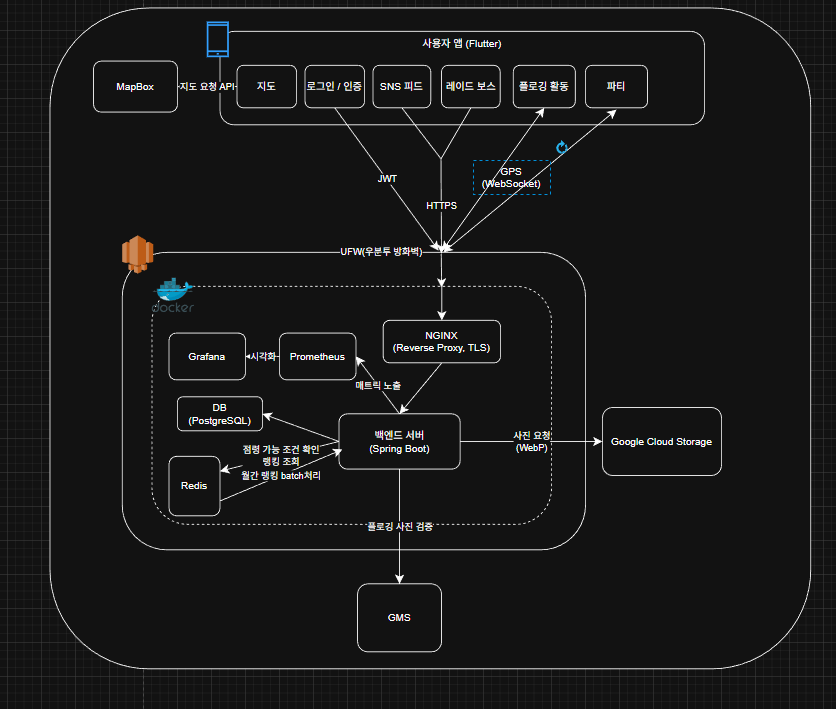

# 🌍 지구를 구하는 가장 즐거운 방법, 줍땅 (JUPDDANG)


> **"플로깅(Plogging)을 게임처럼! 전 세계를 줍땅으로 만들어보세요."**

**줍땅(JUPDDANG)**은 조깅을 하며 쓰레기를 줍는 '플로깅' 활동에 **H3 육각형 그리드 시스템**을 도입하여, 사용자가 플로깅한 지역을 자신의 '땅'으로 점령하고 관리할 수 있는 **게이미피케이션(Gamification) 플로깅 서비스**입니다.

---

## ✨ 주요 기능 (Key Features)

### 1. 🗺️ H3 기반 영역 점령 시스템
*   Uber의 **H3 육각형 그리드** 기술을 활용하여 지도를 헥사곤(Hexagon) 단위로 구획화하였습니다.
*   사용자가 플로깅을 완료한 구역(헥사곤)은 사용자의 영토가 됩니다.
*   친구 또는 다른 사용자와 땅따먹기 경쟁을 통해 플로깅의 재미를 극대화합니다.

### 2. 🤖 AI 쓰레기 자동 탐지 (Trash Detection)
*   **Google Gemini API**를 활용하여 플로깅 중 주은 쓰레기 사진을 분석합니다.
*   쓰레기 종류를 자동으로 식별하고 분류하여 사용자에게 경험치와 포인트를 지급합니다.

### 3. 🏃 실시간 파티 플로깅 (Party Plogging)
*   WebSocket 기반의 실시간 위치 공유 시스템을 통해 친구들과 함께 플로깅을 즐길 수 있습니다.
*   파티원들의 위치와 이동 경로를 실시간으로 지도 위에서 확인할 수 있습니다.

### 4. 👾 레이드 보스 & 펫 시스템
*   특정 지역이나 조건에서 **레이드 보스**가 등장하여 협동 플로깅 이벤트를 제공합니다.
*   귀여운 **수달 펫**과 함께 성장하며 다양한 배지와 칭호를 획득할 수 있습니다.

---

## 🛠️ 기술 스택 (Tech Stack)

### Backend


### Frontend


### Database & Infra


### AI & External APIs


---

## 🏗️ 시스템 아키텍쳐 & ERD



---

## 🚀 빌드 및 실행 가이드 (Exec)

본 프로젝트는 Docker Compose를 기반으로 손쉽게 배포할 수 있도록 구성되어 있습니다.

### 1. 사전 요구 사항 (Prerequisites)
*   **Docker** & **Docker Compose** (v2 이상 권장)
*   **Java 21** (Backend 개발 시)
*   **Flutter SDK 3.10.1+** (Frontend 개발 시)
*   **Firebase / GCP 인증 키 파일**

### 2. 환경 변수 설정 (.env)
프로젝트 루트 또는 배포 디렉토리에 `.env.prod` 파일을 생성하고 아래 내용을 작성해야 합니다.

```properties
# [Project Setup]
ENV_TYPE=prod
PROJECT_NAME=jupddang-prod
GCP_CREDENTIALS_PATH=/app/gcp-credentials.json
FIREBASE_CONFIG_PATH=/app/config/firebase-adminsdk.json

# [Ports]
APP_PORT=50001
DB_PORT=60001
REDIS_PORT=60002

# [Database Config]
POSTGRES_USER=jupddang
POSTGRES_PASSWORD=your_password
POSTGRES_DB=jupddang_prod
DB_HOST=jupddang-db-prod

# [External Keys]
GEMINI_API_KEY=YOUR_GEMINI_API_KEY
GEMINI_API_URL=https://generativelanguage.googleapis.com/v1beta/models/gemini-1.5-flash:generateContent
MAPBOX_ACCESS_TOKEN=YOUR_MAPBOX_TOKEN
```

### 3. 필수 파일 위치
배포 전 아래 파일들이 올바른 위치에 있는지 확인하세요.

| 파일명 | 위치 | 용도 |
|---|---|---|
| `gcp-credentials.json` | 프로젝트 루트 (Docker 볼륨 마운트) | Google Cloud Storage 접근 |
| `jupddang-firebase.json` | `/home/gitlab-runner/config/firebase/` | Firebase Admin SDK 인증 |
| `google-services.json` | `Frontend/jupddang/android/app/` | Android 앱 빌드용 |

### 4. 서버 실행 (Docker Compose)

백엔드 및 데이터베이스 컨테이너를 실행합니다.

```bash
# Docker 이미지 빌드 및 실행 (Background Mode)
docker compose up -d --build
```

**[실행되는 서비스]**
1.  **jupddang-backend-prod**: Spring Boot API 서버 (Port: 50001)
2.  **jupddang-db-prod**: PostgreSQL + PostGIS (Port: 60001)
3.  **jupddang-redis-prod**: Redis Cache (Port: 60002)

### 5. Frontend 빌드 (Android)

```bash
cd Frontend/jupddang
flutter pub get
flutter build apk --release
```

